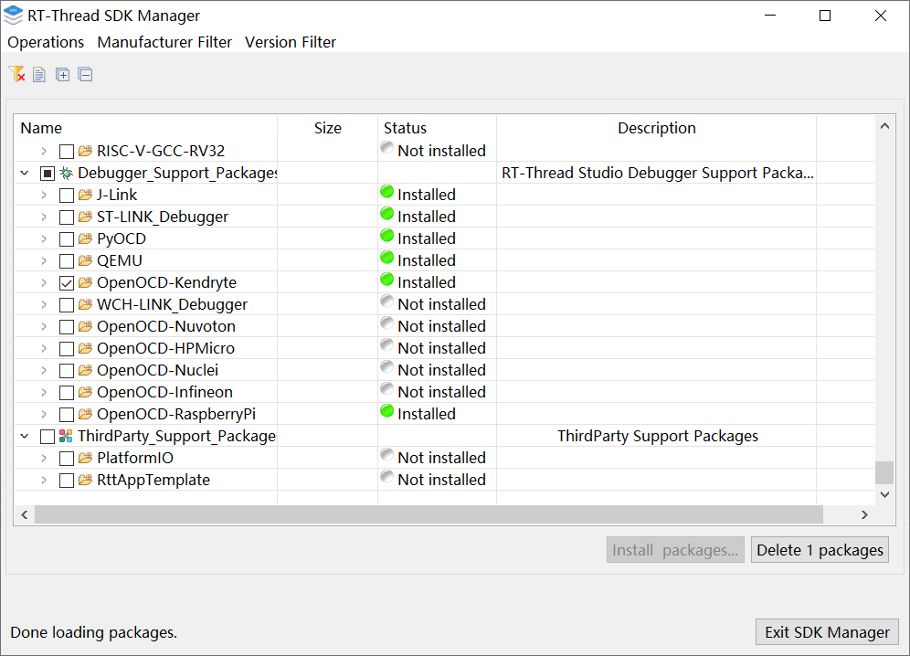
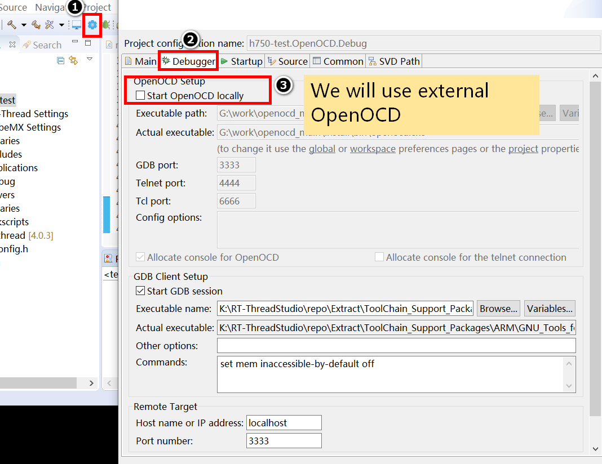
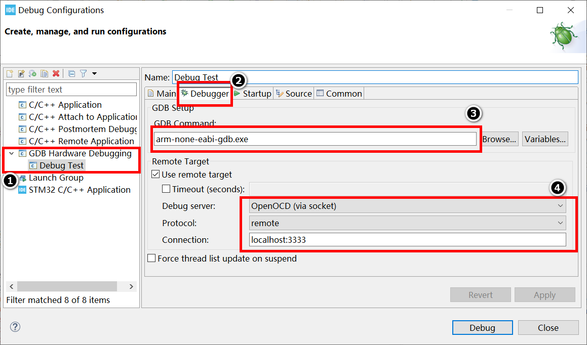
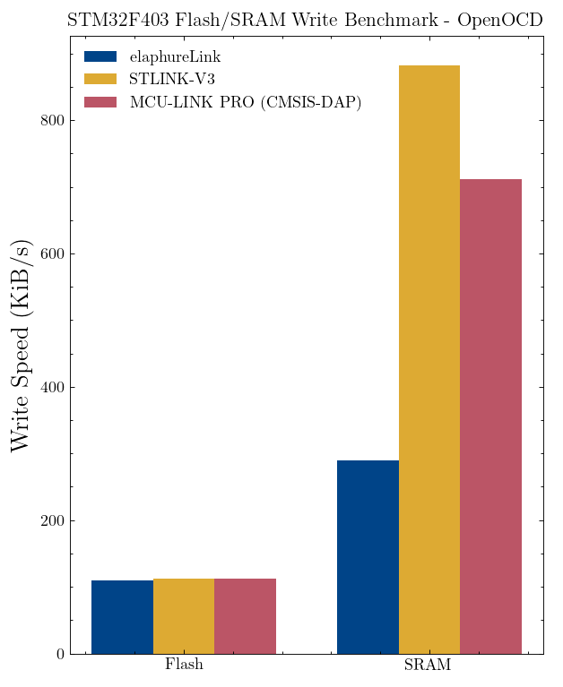

# OpenOCD-elaphureLink

[](https://github.com/windowsair/openocd-elaphurelink/actions/workflows/build.yml)

## Overview

elaphureLink-OpenOCD provides direct TCP/IP connection between CMSIS-DAP probe and OpenOCD.

> elaphureLink Project: https://github.com/windowsair/elaphureLink

Supported debug probe:

https://github.com/windowsair/wireless-esp8266-dap

Supported system:

- [x] Windows
- [x] Linux

> Ubuntu: 20.04 or later.

## Getting Started

### Installation

Getting OpenOCD-elaphureLink binary packages:

- Stable version from release:

    https://github.com/windowsair/openocd-elaphurelink/releases/

- Develop version from CI:

    https://github.com/windowsair/openocd-elaphurelink/actions/workflows/build.yml

For Ubuntu user, require following dependencies:

```bash
apt install libcapstone-dev libhidapi-dev libftdi1-dev libusb-1.0-0-dev libuv1-dev libjaylink-dev
```

### Usage

Use [elaphurelink.cfg](./elaphurelink.cfg) as OpenOCD interface:

```bash
./bin/openocd -f ./share/openocd/scripts/interface/elaphurelink.cfg
```

The default config will use `dap.local` as device address.

You can use command to change device address:

```bash
./bin/openocd -f ./share/openocd/scripts/interface/elaphurelink.cfg -c "cmsis-dap elaphurelink addr 127.0.0.1"
```

Or use commands entirely:

```bash
./bin/openocd -c "adapter driver cmsis-dap" -c "cmsis-dap backend elaphurelink" -c "cmsis-dap elaphurelink addr dap.local"
```

### Integrate with IDE

#### RT-Thread Studio

RT-Thread Studio doesn't export OpenOCD for all projects. Follow these steps to manually add OpenOCD support to a project.

First, open "SDK Manager" in toolbar, then install "OpenOCD-Kendryte" package.

Note that we won't use this OpenOCD. It's just a placeholder for debug configuration.



Then, edit the `.settings/projcfg.ini` file in your project directory, set `hardware_adapter` config to `KFlash`:

```
hardware_adapter=KFlash
```

Reload your project, open "Debug configuration", and then add config for OpenOCD gdb server:



Launch external OpenOCD with proper configurations, then debugging can be started.

#### STM32CubeIDE

Add the OpenOCD gdb server in the debug configuration:



Launch external OpenOCD with proper configurations, then debugging can be started.

## Benchmark

STM32F403 Flash/SRAM write benchmark:



> Our results are reproducible. See [test result](benchmark/result.md)

## Build

See [build.yml](.github/workflows/build.yml)

## License

[GPLv2](./LICENSE)
